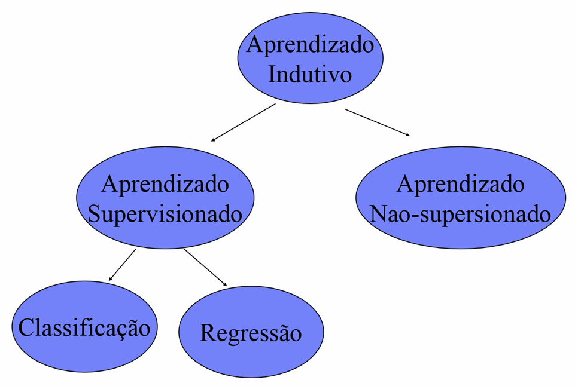

# Sistemas de Aprendizado

Deve ser observado que não existe um único algoritmo que apresente o melhor desempenho para todos os problemas, é importante compreender o poder e a limitação dos diversos algoritmos de aprendizado de máquina utilizando de algum método de avaliação.

## Aprendizado indutivo

A indução é a forma de inferência lógica, **processo que permite obter conclusões genéricas sobre um conjunto particular de exemplos**. Um conceito é aprendido efetuando-se inferência indutiva sobre os exemplos apresentados. Portanto, as hipóteses geradas podem ou não preservar a verdade.

**CUIDADO:** Apesar de ser o recurso mais utilizado pelo cérebro humando para obter conhecimento novo, se o número de exemplos for insuficiente, ou mal escolhidos, não reflitiram as características do domínio.

## Tipos de aprendizado indutivo

Pequenas definições:

**Target:** Variável alvo que se quer prever.  
**Labels:** Valores que a variável alvo pode assumir.

**Aprendizado supervisionado:** Conjunto de exemplos de treinamento para os quais o rótulo da classe associada é conhecio.  
 - Objetivo: contruir um classificado para determinar a classe a que pertence um novo exemplo ainda não rotulado.

**Aprendizado não-supervisioando:** O indutor analisa os exemplos de treinamento e tenta determinar se alguns deles podem ser agrupados de algum modo, formando **agrupamentos** ou **clusters**. 
- Após isto é necessária uma análise para determinar o que cada agrupamento significa.

## Paradigmas de aprendizado

- Aprendizado Supervisionado

- Aprendizado Não-supervisioando

- Aprendizado por reforço