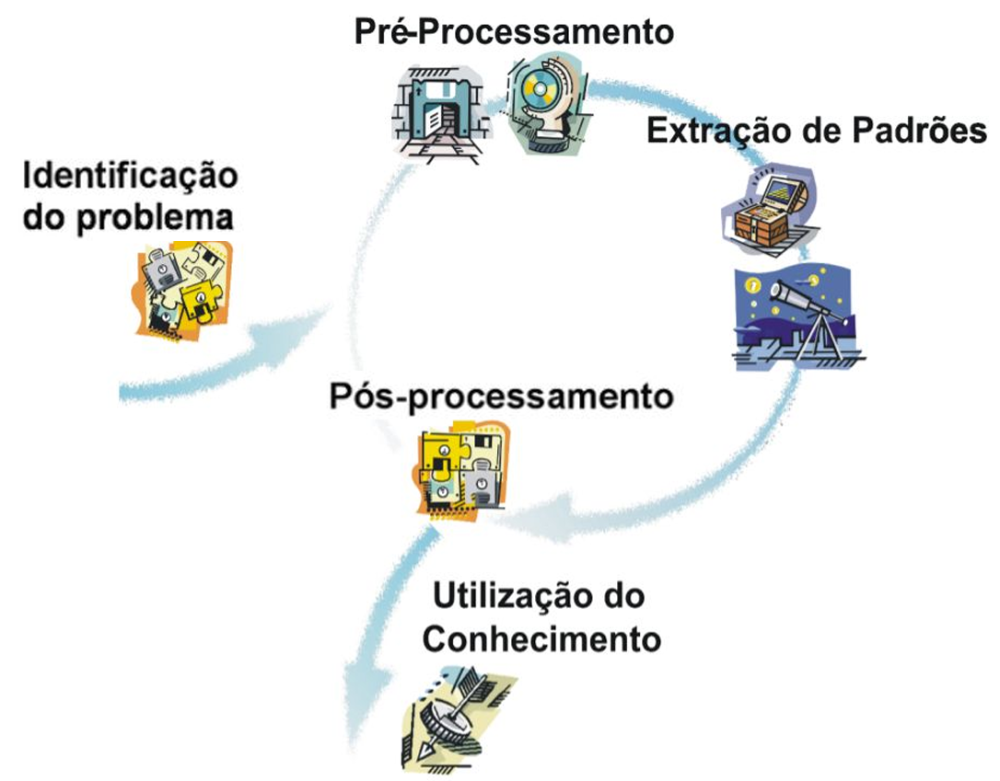

# Processo de Mineração de Dados

**Objetivo:** Extração de conhecimento útil e interessante, a partir de dados, para utilização em um processo de tomada de decisão.

## Etapas

- **Identificação do problema:**
    - Qual objetivo?
    - Quais dados disponíveis?
    - Quais são as metas?
- **Pré-Processamento:**
    - Como representar os dados para a etapa de extração de padrões? (Tabela com atributos e instâncias)
    - Filtro e Limpeza, Valores Ausentes, Valores Inconsistentes
    - Normalização e Padronização
    - Redução da Dimensionalidade e Balanceamento de Dados
- **Extração de Padrões:**
    - Métodos de aprendizado de máquina
    - Tarefas preditivas e descritivas (Aprendizado Supervisioando e Não-supervisionado)
- **Pré-processamento:**
    - As metas foram atingidas?
    - Quais os critérios de avaliação?
- **Utilização do conhecimento:**
    - Diversar finalidades